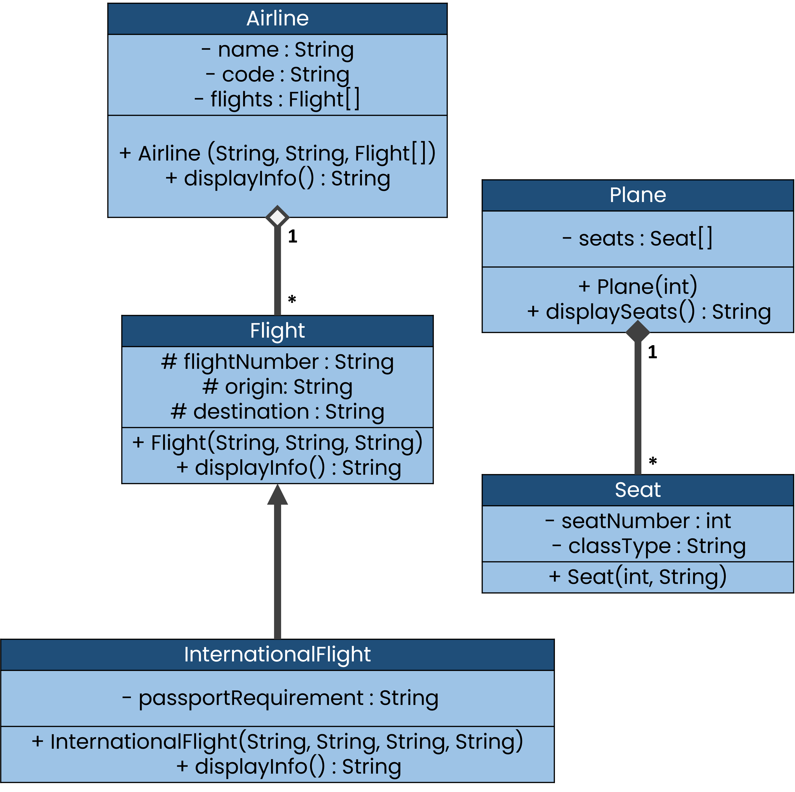

# Airline Flight Management (OOP Demo)

Educational Java OOP lab demonstrating aggregation, composition, and inheritance by modeling an airline system: flights, planes, seats, and a demo runner.

<div align="center">
    
</div>

## Project Overview

- **Purpose:** Educational sample implementing object-oriented design (aggregation, composition, inheritance) in Java.
- **Language:** Java (JDK 8+)

## Key Classes

- `Airline` — Manages flights and provides high-level operations.
- `AirportDemo` — Small runner/demo that exercises the model; contains `main`.
- `Flight` — Base flight class representing a flight, with composition/aggregation of `Plane` and `Seat`.
- `InternationalFlight` — Subclass of `Flight` with international-specific behavior.
- `Plane` — Represents an airplane with capacity and seat layout.
- `Seat` — Represents a seat on a plane.

## Project Structure

- src/
  - Airline.java
  - AirportDemo.java
  - Flight.java
  - InternationalFlight.java
  - Plane.java
  - Seat.java

## Build & Run

From the repository root run:

```bash
javac -d out src/*.java
java -cp out AirportDemo
```

Or (single-line compile+run):

```bash
mkdir -p out && javac -d out src/*.java && java -cp out AirportDemo
```

Make sure `javac`/`java` are in your PATH and using JDK 8 or newer.

## Notes

- This repository is a teaching exercise; tests and packaging are intentionally minimal.

## License & Author

Provided as course material. Adapt and reuse for learning purposes.